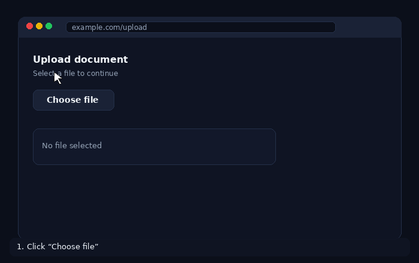

# SnapFile

**Attach recent downloads and clipboard images to any upload field — in one click.**

[](LICENSE)
[](https://developer.chrome.com/docs/extensions/mv3/intro/)
[](https://mudot.github.io/SnapFile/)

<p align="center">
  
</p>

SnapFile is a Chromium browser extension that speeds up file uploads. When you click an `<input type="file">`, instead of only opening the system file picker, SnapFile shows a fast UI with files you **actually just used** — recent downloads and images you copied to the clipboard.

- **Website:** [https://mudot.github.io/SnapFile/](https://mudot.github.io/SnapFile/)
- **Privacy:** [https://mudot.github.io/SnapFile/privacy.html](https://mudot.github.io/SnapFile/privacy.html)
- **Terms:** [https://mudot.github.io/SnapFile/terms.html](https://mudot.github.io/SnapFile/terms.html)

---

## Features

| Feature | Description |
|--------|-------------|
| **Upload interception** | Clicking a file input opens SnapFile (with a native picker fallback) |
| **Recent downloads** | Watches completed downloads and offers them for quick attach |
| **Clipboard images** | Copied images can appear in the library automatically |
| **Preview** | List + side preview panel (real thumbnails for images) |
| **Local-first** | Metadata and cache stay on your device — no SnapFile server stores your files |
| **Native fallback** | “Choose from computer…” opens the system file dialog anytime |

---

## How it works

```
A website asks for a file (input type=file)
        ↓
SnapFile intercepts the click
        ↓
Shows recent downloads and clipboard images
        ↓
You pick a file (with preview)
        ↓
Extension builds a File + DataTransfer
        ↓
input.files is set + change/input events fire
        ↓
The website receives a normal upload
```

---

## Install (developer mode)

Until the extension is on the Chrome Web Store:

1. Clone this repository:
   ```bash
   git clone https://github.com/mudot/SnapFile.git
   cd SnapFile
   ```
2. Open Chrome at `chrome://extensions`
3. Enable **Developer mode**
4. Click **Load unpacked** and select the project folder (the one that contains `manifest.json`)
5. (Recommended) Open the extension **Details** and enable **Allow access to file URLs** — improves reading local downloads

Works on Chrome, Brave, Opera, Vivaldi, and other Chromium browsers. Edge is supported for local features.

---

## Quick start

1. Download a file **or** copy an image  
2. On any site, click the **file upload** / **Choose file** field  
3. SnapFile opens → pick a file from the list  
4. Confirm → the file is attached to the form  

UI shortcuts:

- **Click** an item → focus + preview  
- **Enter** / **Use file** / double-click → attach  
- **Esc** → close  
- **Choose from computer…** → native system picker

---

## Demo

<p align="center">
  
</p>

---

## Project structure

```
SnapFile/
├── manifest.json          # Manifest V3
├── background.js          # Service worker (downloads, clipboard, messaging)
├── content.js             # File-input interception + SnapFile UI
├── icons/                 # Extension icons
├── test-page.html         # Local test page
└── docs/                  # GitHub Pages site (landing, privacy, terms)
```

---

## Privacy (summary)

- **Downloads and clipboard** are handled **locally** in your browser  
- File cache and metadata live in extension storage / IndexedDB on your device  
- SnapFile does **not** run a backend that stores your personal files  
- You can clear extension data or uninstall anytime  

Full policy: [Privacy Policy](https://mudot.github.io/SnapFile/privacy.html)

---

## Compatibility

| Browser | Support |
|---------|---------|
| Google Chrome | Yes |
| Brave / Opera / Vivaldi | Yes |
| Microsoft Edge | Yes (local features) |
| Firefox | Not in this build (Chromium MV3 focus) |

---

## Development

- Manifest **V3**  
- No required build step in the current version (load the folder directly)  
- Messaging between content script and service worker (`GET_LIBRARY`, `GET_CONTENT`, etc.)

Contributions: open an [issue](https://github.com/mudot/SnapFile/issues) or a pull request.

---

## Roadmap

- [ ] Chrome Web Store release  
- [ ] Global quick-search shortcut for files  
- [ ] Automated packaging / release builds  
- [ ] Firefox support (WebExtensions)

---

## License

MIT (or the license defined in the `LICENSE` file).

---

## Links

- **Repository:** https://github.com/mudot/SnapFile/  
- **Website:** https://mudot.github.io/SnapFile/  
- **Issues:** https://github.com/mudot/SnapFile/issues  

---

<p align="center">Built to make uploading files a little less painful.</p>
