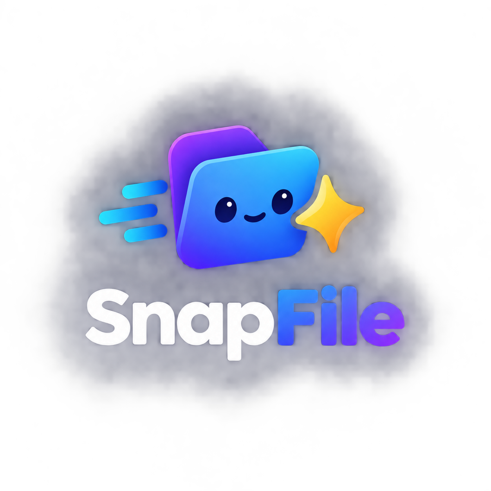

# SnapFile

**Anexe downloads recentes, imagens do clipboard e arquivos do Google Drive em qualquer campo de upload — com um clique.**

[](LICENSE)
[](https://developer.chrome.com/docs/extensions/mv3/intro/)
[](https://mudot.github.io/SnapFile/)

<p align="center">
  
</p>

SnapFile é uma extensão de navegador (Chromium) inspirada na ideia do *Easy Files*: quando você clica em um `<input type="file">`, em vez de abrir só o seletor do sistema, a extensão mostra uma interface rápida com arquivos que você **já usou de verdade** — baixados, copiados ou no Drive.

- **Site:** [https://mudot.github.io/SnapFile/](https://mudot.github.io/SnapFile/)
- **Privacidade:** [https://mudot.github.io/SnapFile/privacy.html](https://mudot.github.io/SnapFile/privacy.html)
- **Termos:** [https://mudot.github.io/SnapFile/terms.html](https://mudot.github.io/SnapFile/terms.html)

---

## Recursos

| Recurso | Descrição |
|--------|-----------|
| **Interceptação de upload** | Ao clicar em um campo de arquivo, abre o SnapFile (com fallback para o seletor nativo) |
| **Downloads recentes** | Monitora downloads concluídos e oferece os arquivos para anexar |
| **Clipboard** | Imagens copiadas podem entrar na biblioteca automaticamente |
| **Preview** | Lista + painel de preview (imagens com miniatura real) |
| **Google Drive (opcional)** | Login, lista do Meu Drive, download e anexo no `input` |
| **Local-first** | Cache e metadados no dispositivo; sem servidor SnapFile para guardar seus arquivos |

---

## Como funciona

```
Site pede um arquivo (input type=file)
        ↓
SnapFile intercepta o clique
        ↓
Mostra: Local (downloads + clipboard) | Drive
        ↓
Você escolhe um arquivo (com preview)
        ↓
Extensão monta um File + DataTransfer
        ↓
input.files é preenchido + eventos change/input
        ↓
O site recebe o upload normalmente
```

---

## Instalação (modo desenvolvedor)

Enquanto a extensão não estiver na Chrome Web Store:

1. Clone este repositório:
   ```bash
   git clone https://github.com/mudot/SnapFile.git
   cd SnapFile
   ```
2. Abra o Chrome em `chrome://extensions`
3. Ative **Modo do desenvolvedor**
4. Clique em **Carregar sem compactação** e selecione a pasta do projeto (onde está o `manifest.json`)
5. (Recomendado) Em **Detalhes** da extensão, ative **Permitir acesso a URLs de arquivo** — melhora a leitura de downloads locais

> **Edge:** a parte Local funciona; o login Google via `chrome.identity` é limitado no Edge. Para Drive, prefira o **Chrome**.

---

## Uso rápido

1. Baixe um arquivo **ou** copie uma imagem  
2. Em qualquer site, clique no campo **Enviar arquivo** / **Choose file**  
3. O SnapFile abre → escolha na lista ou use a aba **Drive**  
4. Confirme → o arquivo é anexado ao formulário  

Atalhos na interface:

- **Clique** no item → foco + preview  
- **Enter** / **Usar arquivo** / duplo clique → anexa  
- **Esc** → fecha  
- **Escolher no computador…** → seletor nativo  

---

## Google Drive (opcional)

### Configuração (desenvolvedor)

1. [Google Cloud Console](https://console.cloud.google.com/) → criar/selecionar projeto  
2. Ativar **Google Drive API**  
3. Configurar **Tela de consentimento OAuth**  
4. Criar credencial OAuth tipo **Extensão do Chrome**  
   - Application ID = ID da extensão em `chrome://extensions`  
5. Colocar o Client ID no `manifest.json`:

```json
"oauth2": {
  "client_id": "SEU_CLIENT_ID.apps.googleusercontent.com",
  "scopes": [
    "https://www.googleapis.com/auth/drive.readonly"
  ]
}
```

6. Em desenvolvimento: status **Testing** + adicionar **Usuários de teste** (seu Gmail)  
7. Em produção: publicar a tela de consentimento e concluir a verificação OAuth da Google (escopo sensível)

### Escopo

| Escopo | Motivo |
|--------|--------|
| `drive.readonly` | Listar arquivos do Meu Drive e baixar **somente** o arquivo que o usuário selecionar para anexar |

Uso de dados do Google em conformidade com a [Google API Services User Data Policy](https://developers.google.com/terms/api-services-user-data-policy) (Limited Use): apenas para a função de escolher e anexar o arquivo; sem anúncios e sem venda de dados.

---

## Estrutura do projeto

```
SnapFile/
├── manifest.json          # Manifest V3
├── background.js          # Service worker (downloads, clipboard, mensagens)
├── drive-adapter.js       # OAuth Google + listagem/download Drive
├── content.js             # Interceptação do input + UI SnapFile
├── icons/                 # Ícones da extensão
├── test-page.html         # Página de teste local
└── docs/                  # Site GitHub Pages (landing, privacy, terms)
```

---

## Privacidade (resumo)

- **Downloads e clipboard:** processados **localmente** no navegador  
- **Google Drive:** só depois de você clicar em **Conectar**; cada arquivo anexado é uma escolha explícita  
- **Não** operamos backend que armazene seus arquivos do Drive  
- Você pode sair da conta no SnapFile ou revogar em [myaccount.google.com/permissions](https://myaccount.google.com/permissions)

Política completa: [Privacy Policy](https://mudot.github.io/SnapFile/privacy.html)

---

## Compatibilidade

| Navegador | Local + Clipboard | Google Drive |
|-----------|-------------------|--------------|
| Google Chrome | Sim | Sim (recomendado) |
| Brave / Opera / Vivaldi | Sim | Em geral sim (Chromium) |
| Microsoft Edge | Sim | Limitado / instável (`identity`) |
| Firefox | Não nesta build (foco Chromium MV3) |

---

## Desenvolvimento

- Manifest **V3**  
- Sem build obrigatório na versão atual (carregar a pasta direto)  
- Mensagens: content script ↔ service worker (`GET_LIBRARY`, `GET_CONTENT`, `DRIVE_*`, etc.)

Contribuições: abra uma [issue](https://github.com/mudot/SnapFile/issues) ou pull request.

---

## Roadmap (ideias)

- [ ] Publicação na Chrome Web Store  
- [ ] Dropbox / OneDrive (adapters opcionais)  
- [ ] Atalho global de busca rápida de arquivos  
- [ ] Build separado / empacotamento automatizado  
- [ ] Melhor suporte a Firefox (WebExtensions)

---

## Licença

MIT (ou a licença que você definir no arquivo `LICENSE`).

---

## Links

- **Repositório:** https://github.com/mudot/SnapFile/  
- **Site:** https://mudot.github.io/SnapFile/  
- **Issues:** https://github.com/mudot/SnapFile/issues  

---

<p align="center">Feito para tornar o upload um pouco menos irritante.</p>
